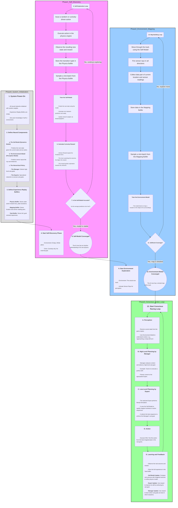

```mermaid
graph TD
    %% =================================================================
    %% Masterplan: Lifecycle of a Hierarchical Conscious AI Agent
    %% Design: Based on user concepts of awareness, exploration, and planning.
    %% Version: 3.0 (Ultra-Safe Parser Edition)
    %% =================================================================

    %% -----------------------------------------------------------------
    %% Phase 0: System Initialization & Neural Architecture
    %% -----------------------------------------------------------------
    subgraph Phase0_System_Initialization
        style Phase0_System_Initialization fill:#ddd,stroke:#333,stroke-width:2px

        INIT_START("
        <div style='font-weight:bold; font-size:16px; margin-bottom:5px;'>1. System Power-On</div>
        <div style='text-align:left; font-size:12px;'>
        - All neural networks initialized with random weights.<br/>
        - Experience Replay Buffers are empty.<br/>
        - Zero prior knowledge of self or environment.
        </div>
        ")

        INIT_MODELS("
        <div style='font-weight:bold; font-size:14px; margin-bottom:5px;'>2. Define Neural Components</div>
        <div style='text-align:left; font-size:12px;'>
        <b>a. The Self-Model (Dynamics Model):</b><br/>
        &nbsp;&nbsp;&nbsp;&nbsp;- Predicts the next state given the current state and an action.<br/>
        <b>b. The Environment-Model (Perception Model):</b><br/>
        &nbsp;&nbsp;&nbsp;&nbsp;- Predicts sensor inputs like ray-cast distances.<br/>
        <b>c. The Hierarchical Policy:</b><br/>
        &nbsp;&nbsp;&nbsp;&nbsp;<b>- The Manager:</b> Selects high-level sub-goals.<br/>
        &nbsp;&nbsp;&nbsp;&nbsp;<b>- The Experts:</b> Specialized networks to execute sub-goals.
        </div>
        ")

        INIT_MEMORY("
        <div style='font-weight:bold; font-size:14px; margin-bottom:5px;'>3. Define Experience Replay Buffers</div>
        <div style='text-align:left; font-size:12px;'>
        - <b>Physics Buffer:</b> Stores state-action-reward-next_state transitions.<br/>
        - <b>Mapping Buffer:</b> Stores location and sensor reading pairs.<br/>
        - <b>Task Buffer:</b> Stores full, goal-oriented trajectories.
        </div>
        ")
        INIT_START --> INIT_MODELS --> INIT_MEMORY
    end

    %% -----------------------------------------------------------------
    %% Phase 1: Self-Discovery (Learning Physics via Intrinsic Motivation)
    %% -----------------------------------------------------------------
    subgraph Phase1_Self_Discovery
        style Phase1_Self_Discovery fill:#f9f,stroke:#333,stroke-width:2px

        SELF_START("
        <div style='font-weight:bold; font-size:14px; margin-bottom:5px;'>4. Start Self-Discovery Phase</div>
        <div style='text-align:left; font-size:12px;'>
        - Environment: Empty, infinite plane.<br/>
        - Drive: Curiosity only. No external goal.
        </div>
        ")
        
        SELF_LOOP_START("
        <div style='font-weight:bold; font-size:12px;'>5. Self-Exploration Loop</div>
        ")

        SELF_ACTION(Issue a random or curiosity-driven action)
        SELF_EXECUTE(Execute action in the physics engine)
        SELF_OBSERVE(Observe the resulting new state and reward)
        SELF_STORE(Store the transition tuple in the Physics Buffer)
        SELF_TRAIN_PREPARE(Sample a mini-batch from the Physics Buffer)
        SELF_TRAIN_MODEL("
        <div style='font-weight:bold; font-size:12px;'>Train the Self-Model</div>
        <div style='text-align:left; font-size:11px;'>
        - Predict the next state using the model.<br/>
        - Calculate error between prediction and reality.<br/>
        - Update network weights via backpropagation.
        </div>
        ")
        
        SELF_CURIOSITY("
        <div style='font-weight:bold; font-size:12px;'>6. Calculate Curiosity Reward</div>
        <div style='text-align:left; font-size:11px;'>
        - Intrinsic Reward equals the Prediction Error.<br/>
        - The more surprising the outcome, the higher the reward.<br/>
        - This reward guides exploration towards the unknown.
        </div>
        ")

        SELF_CHECK_CONVERGENCE{"
        <div style='font-weight:bold; font-size:12px;'>7. Is the Self-Model Accurate?</div>
        <div style='text-align:left; font-size:11px;'>
        (Is the average prediction error low?)
        </div>
        "}

        SELF_MODEL_COMPLETE(("
        <div style='font-weight:bold; font-size:14px;'>8. Self-Model Converged</div>
        <div style='text-align:left; font-size:12px;'>
        The AI now has an intuitive understanding of its own physics.
        </div>
        "))

        SELF_LOOP_START --> SELF_ACTION --> SELF_EXECUTE --> SELF_OBSERVE --> SELF_STORE --> SELF_TRAIN_PREPARE --> SELF_TRAIN_MODEL --> SELF_CURIOSITY --> SELF_CHECK_CONVERGENCE
        SELF_CHECK_CONVERGENCE -- "No, continue exploring" --> SELF_LOOP_START
        SELF_CHECK_CONVERGENCE -- "Yes, model is stable" --> SELF_MODEL_COMPLETE
    end

    %% -----------------------------------------------------------------
    %% Phase 2: Environment Discovery (Building a Mental Map)
    %% -----------------------------------------------------------------
    subgraph Phase2_Environment_Mapping
        style Phase2_Environment_Mapping fill:#9cf,stroke:#333,stroke-width:2px

        MAP_START("
        <div style='font-weight:bold; font-size:14px; margin-bottom:5px;'>9. Start Environment Exploration</div>
        <div style='text-align:left; font-size:12px;'>
        - Environment: The actual race track.<br/>
        - Activate Sensor Rays for perception.
        </div>
        ")
        
        MAP_LOOP_START("
        <div style='font-weight:bold; font-size:12px;'>10. Map-Building Loop</div>
        ")
        
        MAP_MOVE(Move through the track using the Self-Model)
        MAP_SENSE(Fire sensor rays in all directions)
        MAP_COLLECT(Collect data pair of current location and sensor readings)
        MAP_STORE(Store data in the Mapping Buffer)
        MAP_TRAIN_PREPARE(Sample a mini-batch from the Mapping Buffer)
        MAP_TRAIN_MODEL("
        <div style='font-weight:bold; font-size:12px;'>Train the Environment-Model</div>
        <div style='text-align:left; font-size:11px;'>
        - The model learns to map a location to the shape of its surroundings.
        </div>
        ")

        MAP_CHECK_COVERAGE{"
        <div style='font-weight:bold; font-size:12px;'>11. Sufficient Coverage?</div>
        "}
        
        MAP_MODEL_COMPLETE(("
        <div style='font-weight:bold; font-size:14px;'>12. Environment-Model Converged</div>
        <div style='text-align:left; font-size:12px;'>
        The AI now has a mental map of the track.
        </div>
        "))

        MAP_LOOP_START --> MAP_MOVE --> MAP_SENSE --> MAP_COLLECT --> MAP_STORE --> MAP_TRAIN_PREPARE --> MAP_TRAIN_MODEL --> MAP_CHECK_COVERAGE
        MAP_CHECK_COVERAGE -- "No, explore more" --> MAP_LOOP_START
        MAP_CHECK_COVERAGE -- "Yes, map is detailed" --> MAP_MODEL_COMPLETE
    end

    %% -----------------------------------------------------------------
    %% Phase 3: The Conscious Action Loop (Perceive-Plan-Act-Learn Cycle)
    %% -----------------------------------------------------------------
    subgraph Phase3_Conscious_Action_Loop
        style Phase3_Conscious_Action_Loop fill:#9f9,stroke:#333,stroke-width:2px

        MAIN_LOOP("
        <div style='font-weight:bold; font-size:16px;'>13. Start Conscious Racing Loop</div>
        ")

        PERCEIVE("
        <div style='font-weight:bold; font-size:14px;'>A. Perception</div>
        <div style='text-align:left; font-size:12px;'>
        - Receive current state from the game engine.<br/>
        - Use Environment-Model to understand context, e.g., 'approaching a sharp left turn'.
        </div>
        ")
        
        PLAN_MANAGER("
        <div style='font-weight:bold; font-size:14px;'>B. High-Level Planning by Manager</div>
        <div style='text-align:left; font-size:12px;'>
        - Manager analyzes context and selects a high-level sub-goal.<br/>
        - Example: 'Goal is to execute a perfect drift'.<br/>
        - Passes control to the appropriate Expert.
        </div>
        ")

        PLAN_EXPERT("
        <div style='font-weight:bold; font-size:14px;'>C. Low-Level Planning by Expert</div>
        <div style='text-align:left; font-size:12px;'>
        - The selected Expert performs Mental Simulation.<br/>
        - It uses the Self-Model to rapidly imagine hundreds of action sequences.<br/>
        - It selects the best sequence to achieve the Manager's sub-goal.
        </div>
        ")

        ACT("
        <div style='font-weight:bold; font-size:14px;'>D. Action</div>
        <div style='text-align:left; font-size:12px;'>
        - Execute ONLY the first action from the best imagined plan in the real game.
        </div>
        ")

        LEARN_FEEDBACK("
        <div style='font-weight:bold; font-size:14px;'>E. Learning and Feedback</div>
        <div style='text-align:left; font-size:12px;'>
        - Observe the real outcome and reward.<br/>
        - Store the full experience in the Task Buffer.<br/>
        - <b>Self-Model Update:</b> Compare real outcome with imagined outcome to refine physics model.<br/>
        - <b>Expert Update:</b> Use reward to improve its skill at achieving its sub-goal.<br/>
        - <b>Manager Update:</b> Use reward to learn which sub-goals are best in which situations.
        </div>
        ")
        
        MAIN_LOOP --> PERCEIVE --> PLAN_MANAGER --> PLAN_EXPERT --> ACT --> LEARN_FEEDBACK --> MAIN_LOOP
    end

    %% -----------------------------------------------------------------
    %% Linking the High-Level Phases Together
    %% -----------------------------------------------------------------
    INIT_MEMORY --> SELF_START
    SELF_MODEL_COMPLETE --> MAP_START
    MAP_MODEL_COMPLETE --> MAIN_LOOP
```
